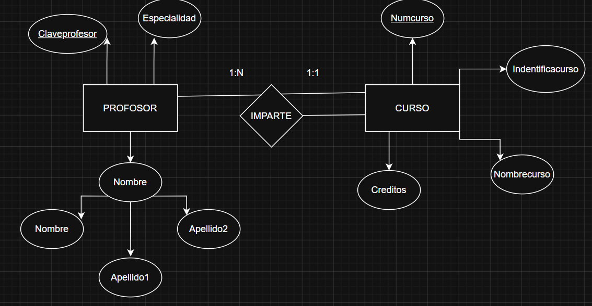
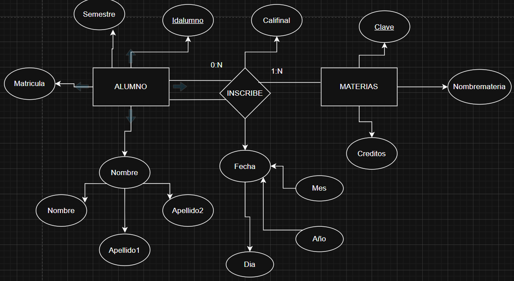
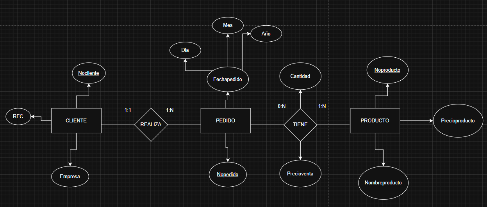
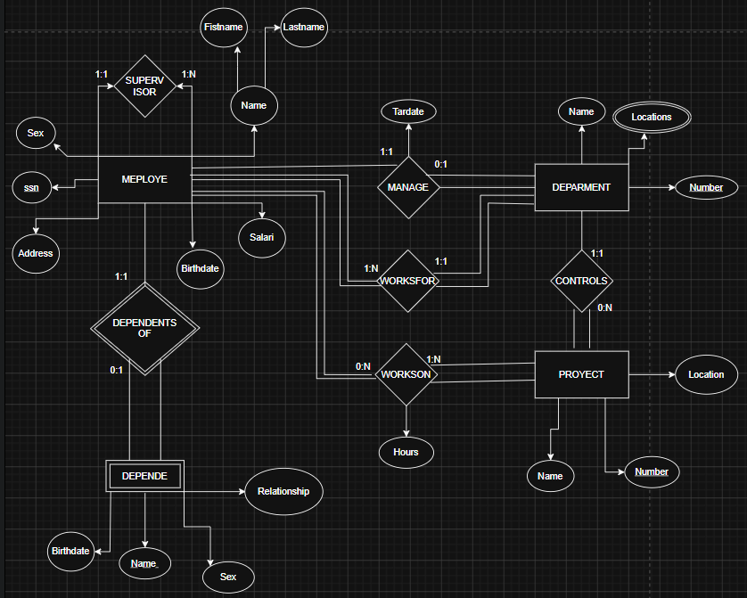
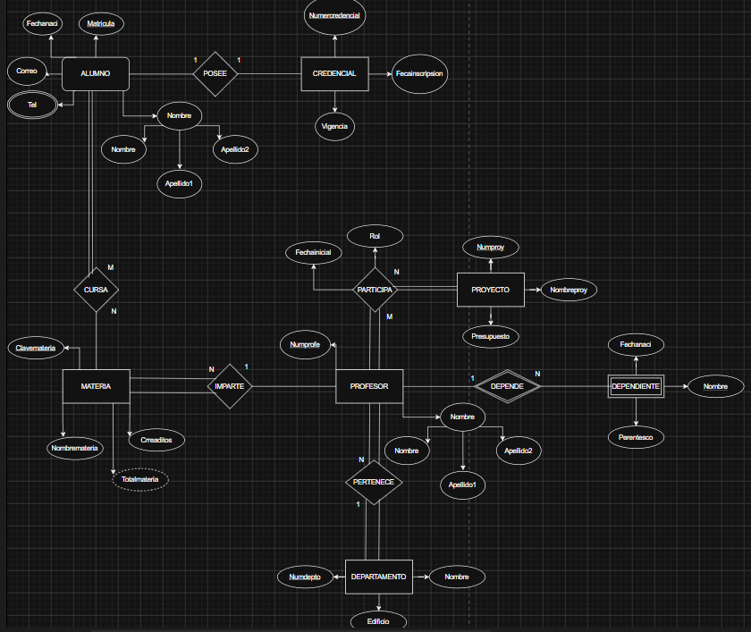

# EJERCICIOS MODELO E-R

# Ejercicio 1:

En un hospital se rguistra informacion de sus pacientes de cada pacioente se desea almacenar algo que lo identoifique

## De cada paciente se desea almacenar :

    - Algo que lo identifique 
    - Nombre
    - Fecha de nacimento

##  De un expediente medioco se almacena:

    - numero de Expediente
    - Fecha de Apertura
    - Tipo de Sangre 

## Reglas del Negocio

    1. Cada paciente debe tener exactamente un expediente medico 
    2. Cada expediente pertenece a un unico paciente 
    3. No puede existir ningun expediente medico sin paciente 
    4. No puede existir un paciente sin expediente
  
  ## Diagrama

 

## Ejercicio 2:
Una Universidad administra profesores y cursos.

### De Cada Profesor se almacena:
    
    - Clave Profesor
    - Nombre 
    - Especialidad

### De cada Curso se almacena:

    - Identificacion del curso 
    - Nombre del curso
    - Creditos

### Reglas del Negocio

    1. Un profesor puede impartir varios cursos
    2. Un curso Solamente Puede Ser impartido por un profesor 
    3. Puede Ecistir un Porfesor que no imparta Cursos 
    4. Todo Curso Deve de ser asignado a un profesor

#### Se deve realizar lo siguiente:

    - Entidades
    - Identificar la relacion  
    - Determinar la cardinalidad
    - Determinar la participacion 

## Diagrama
 

## Ejercicio 3:
Una Escuela administra alumnos y materias , de cada alumno 
De cada aluno se admistra

### Alumno

    - matricula 
    - nombre 
    - semetre

### Materia

    - Clave 
    - Nombre de la materia
    - Creditos

### Reglas del negocio

    1. Un alumno puede inscribirse en varias materias 
    2. Una materia puede tener muchos alumnos inscritos 
    3. puede existri una materia sin alumnos inscritos 
    4. Todo alumno deve estar inscrito en almenos 1 materia
    5. De cada Inscirpcion se deve almacenar:  Fecha de Inscripcion , Calificacion Final 
    -Relacion en las 2 entidades

## Diagrama
 
 

## EJERCICIO 4

Una empresa encargada de realizar venta de productos:

### De cada cliente se almacena:

    - Numero de cliente que lo identifique 
    - Y su nombre el cual es una persona moral
    - RFC

### La empresa realiza pedidos en los cuales almacen alos siguente 

    - Numero de pedido
    - Fecha

### la empresa tambien almacena productos de los cuales registra los siguientes 

    - Numero de produto 
    - Nombre y precio 

## Al Realizar los pedidos deven reguistra la cantidad de productos y su precio

### Reglas del Negocio 

    1. Un cliente puede realizar muchos pedidos 
    2. Cada pedido pertenece a un solo cliente 
    3. Un pedidio puede contener varios productos 
    4. U Producto puede aparceer en muchos pedidos 
    5. Un pedido deve de contener un producto 
    6. Un pruducto puede haber no sido vendido
    7. el detalle del pedido no existe sin pedido 
    8. El detalle de pedido no existe sin producto 
    9. El detalle almacena cantidad y precio de venta

## Diagrama 4
 

## EJERCICIO 5

## 1. Entidades y Atributos Identificados

### DEPARTAMENTO

    -  Nombre 
    -  Número
    - Ubicaciones 

### PROYECTO

    - Nombre 
    - Número 
    - Ubicación 

### EMPLEADO

    - SSN
    - Nombre
    - Dirección
    - Salario
    - Sexo
    - Fecha de nacimiento

### DEPENDIENTE

    - Primer Nombre
    - Sexo
    - Fecha de nacimiento
    - Parentesco / Relación

### 2. Relaciones y Reglas de Negocio Clave

    1. Administración de Departamento:
     Un departamento es administrado por un solo empleado. Se debe registrar la **Fecha de inicio** de la gestión.
    2. Control de Proyectos:
     Un departamento controla muchos proyectos; un proyecto pertenece a un solo departamento.
    3. Asignación de Departamento: Un empleado pertenece a un único departamento, pero un departamento tiene muchos empleados.
    4. Trabajo en Proyectos:
    Un empleado puede trabajar en varios proyectos y un proyecto puede tener muchos empleados. Se debe registrar las **Horas semanales** trabajadas en cada combinación.
    5. Supervisión: Un empleado tiene un supervisor directo (que también es un empleado).
    6. Dependientes:
    Un empleado puede tener muchos dependientes registrados para el seguro.

## Diagrama 5
 

# EJERCICIO 6

## 1. Entidades y Atributos Identificados

### ALUMNO

    - Matrícula 
    - Nombre
    - Apellido1
    - Apellido2
    - Correo
    - Tel
    - FechaNac

### CREDENCIAL

    - NumCredencial 
    - Vigencia
    - FechaInscripcion

### CURSA

    - FechaInscripcion
    - CalifFinal

### MATERIA

    - ClaveMateria 
    - NombreMateria
    - Créditos
    - Total materias

### PROFESOR
  
    - NumProf 
    - Nombre
    - Apellido1
    - Apellido2

### DEPARTAMENTO

    - NumDepto 
    - Nombre
    - Edificio

  
### PARTICIPA
  
    - Rol
    - FechaInicio

### PROYECTO

    - NumProy 
    - NombreProy
    - Presupuesto

### DEPENDIENTE
  
    - Nombre
    - FechaNac
    - Parentesco

## Diagrama 6
